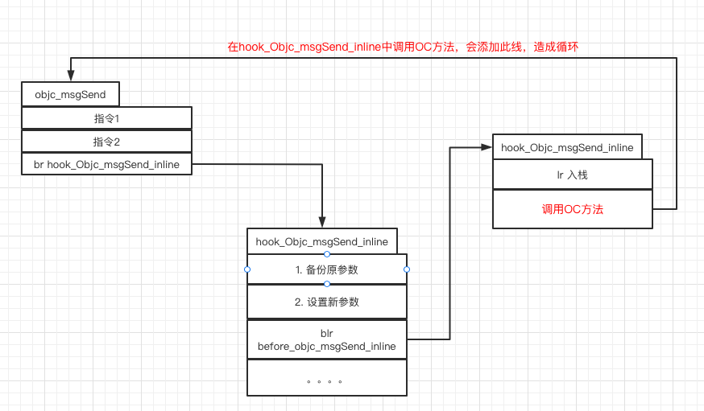
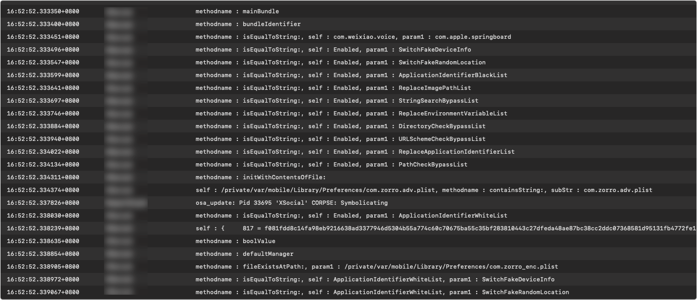

# hook objc_msgSend

`objc_msgSend`是iOS里最重要的方法。

按道理来说，hook objc_msgSend就可以获取到**app中所有调用的OC方法名和参数**等。

所有的OC方法都需要经过`objc_msgSend`方法消息转发寻找方法IMP。

参考[hook objc_msgSend从而获得OC方法执行时间](https://github.com/cxr0715/hook_objc_msgSend)


## 简说objc_msgSend方法

objc_msgSend源码参考 [苹果openSource](https://opensource.apple.com/source/objc4/objc4-723/runtime/Messengers.subproj/objc-msg-arm64.s.auto.html)。

此方法考虑效率，使用汇编编写，此方法大致上有4个关键步骤：

1. 获取传入的target的class
2. 找到class对应方法的缓存
3. 尝试在缓存bukets中找到方法的具体实现。如果没有在cache中找到，则进入消息转发，深层查找，找到后，将方法和对应的IMP写入cache中。
4. 直接调用方法的实现

综上看，这个方法是一个"跳板"函数，并且它是线程安全的。

上述的4个步骤中，1，2，4是线程安全的，3步骤利用一些trick保障了线程安全，具体超出了本文的范围，可查看[剖析objc_msgSend](https://mikeash.com/pyblog/friday-qa-2017-06-30-dissecting-objc_msgsend-on-arm64.html)，其中对objc_msgSend方法的汇编实现，逐行讲解。


## 想法1 视为普通C函数hook

因为根据 `#include <objc/message.h>` 中`objc_msgSend`函数的定义如下:

```
id _Nullable objc_msgSend(id _Nullable self, SEL _Nonnull op, ...)
```

所以将它视为普通的C函数，利用 `fishhook` / `cydia substrate` hook，结合`va_list`分析传入的参数，应该就可以。

但是，不可以。通过据[这里](https://blog.nelhage.com/2010/10/amd64-and-va_arg/)介绍，arm 64位上的va_list结构改变了，不能使用va_list了，因此此方法不能实现。

没有验证正确性。


## 想法2 利用fish Hook+汇编 hook

既然利用va_list获取参数不可行。

参考[objc_msgSend源码](https://opensource.apple.com/source/objc4/objc4-723/runtime/Messengers.subproj/objc-msg-arm64.s.auto.html)，因为在arm 64上，x0 - x8寄存器用于传参，所以结合汇编代码，应该可以hook，[crx0715](https://github.com/cxr0715/hook_objc_msgSend)已经成功，具体可以查看它的讲解。

使用fishhook很好，因为fishhook是导出表hook，不会修改原方法的实现。

大概实现如下：


## 想法3 利用inline hook + 汇编hook

既然fishhook可行，inline hook也可以。

具体流程和fishhook一致，不过有个坑，就是在`before_objc_msgSend_inline`和`after_objc_msgSend_inline`中暂时不能调用OC方法，因为会造成如下循环。



## 得到objc_msgSend的参数

由于参数保存在x0-x8寄存器中，那么在`before_objc_msgSend`中对寄存器分析，就可以获取到入参。

这里有个坑，self参数，在一些app中会引入引用计数问题导致崩溃，具体还没有具体查询。作为TODO吧，现在

```
// 打印调用的OC方法的对象和方法名，和最多两个参数。
void printSpecificParam_fish(id self, SEL _cmd, uintptr_t param1, uintptr_t param2,uintptr_t lr)
{
    // 此方法中暂只能使用C方法,使用OC方法可能会导致寄存器异常导致崩溃，经测试，发生在相同方法调用相同方法时崩溃
    // NSlog可以用
    const char * className = object_getClassName(self);
    const char * selector = sel_getName(_cmd);
    //NSLog(@"class : %s, methodname : %s",className,selector);
    if ( strcmp( selector, "fileExistsAtPath:" ) == 0) {
        NSLog(@"class : %s, methodname : %s, param1 : %@",className,selector,param1);
    }else {
        NSLog(@"class : %s, methodname : %s",className,selector);
    }
}
```

这里有个坑，self参数，在一些app中会引入引用计数问题导致崩溃，还没有具体查询。作为TODO吧，现在

的printSpecificParam_fish参数入参需要修改一下，将self去除：

```
void printSpecificParam_fish( SEL _cmd, uintptr_t param1, uintptr_t param2,uintptr_t lr)
{
		const char * selector = sel_getName(_cmd);
    NSLog(@"methodname : %s",selector);
}
```

## 运行结果

